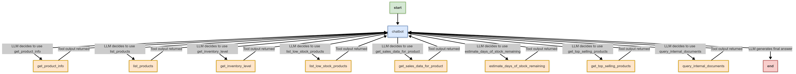

## **Task 1 - Defining your Problem and Audience**

**(Deliverable 1: 1-Sentence Problem Description)**

Scaling Shopify merchants ($1M-$10M revenue) are overwhelmed by operational complexity, data volume across functions, **and difficulty accessing internal documented knowledge**, hindering their ability to make timely, data-driven strategic decisions and maintain consistent operations.

**(Deliverable 2: Why this is a Problem for Your Specific User)**

Shopify store owners and managers operating within the $1 million to $10 million annual revenue bracket face a critical "messy middle" phase. Their operations have outgrown basic tools, leading to significant **operational bottlenecks** in areas like inventory management and order fulfillment. They are often inundated with **data overload** from disparate systems (analytics, ads, CRM) but lack the time or unified tools to distill actionable insights efficiently. **Furthermore, crucial internal knowledge—standard operating procedures (SOPs), company policies, marketing playbooks, best practices—often resides in scattered documents**, making it hard for the team (and especially new hires) to quickly find accurate procedural or policy information when needed.

This combination leads to founders or key managers becoming bottlenecks, trapped in reactive "firefighting" instead of focusing on strategic growth. The inability to easily access synthesized operational insights (e.g., sales velocity vs. inventory) or recall documented procedures quickly leads to suboptimal decisions, operational inconsistencies, wasted time, and potentially eroded profits or poor customer experiences. The specific user – the Owner, CEO, or Head of E-commerce/Operations – needs intelligent assistance to manage both the analytical load from operational data and the recall demands of internal documented knowledge.

**(Deliverable 3: List of Potential User Questions - Covering Both Agent Capabilities)**

Based on the PoC's scope (Sales/Inventory tools + Internal KB RAG tool), here are potential questions the user (merchant) is likely to ask the AI agent:

* **Operational Data / Tool-Based Questions:**
    1.  "What were the total sales revenue for Product ID 'P123' in the last 30 days?"
    2.  "How many units of Product ID 'P456' are currently in stock?"
    3.  "Which products generated the most revenue last week?"
    4.  "Calculate the average daily sales quantity for 'P123' over the past month."
    5.  "Estimate the days of stock remaining for 'P456' based on its 30-day sales velocity."
    6.  "Show me products with less than 10 units currently in stock."
* **Internal Knowledge / RAG-Based Questions:**
    7.  "What is our standard procedure for handling a customer return for a damaged item?"
    8.  "Summarize the key steps for restocking low-inventory products according to the SOP."
    9.  "What discounts can I offer to a VIP customer according to our policy?"
    10. "What are our company's stated best practices for running a flash sale?"

---

## **Task 2 - Propose a Solution**

**(Deliverable 1: Proposed PoC Solution Description)**

We propose developing a Proof of Concept (PoC) for an agentic AI assistant accessed via an interactive web chat interface (React/Next.js frontend, FastAPI backend). This "AI COO" agent will demonstrate **dual capabilities**:
1.  **Operational Analysis:** It will simulate integration with core Shopify data (Products, Orders, Inventory via synthetic CSVs) using custom tools to answer natural language questions about business operations (e.g., sales trends, stock levels, velocity calculations).
2.  **Internal Knowledge Retrieval:** It will utilize a Retrieval-Augmented Generation (RAG) tool to query a vector store built from synthetic internal documents (SOPs, policies, best practices), allowing it to answer questions about company procedures and guidelines.

This PoC showcases how an AI agent can serve as a single interface for merchants to access both structured operational insights and unstructured internal knowledge. The "better world" involves users getting quick, accurate answers to a wider range of operational and procedural questions without switching contexts or searching through disparate data sources or document folders, thus saving significant time and improving decision consistency. While reliant on synthetic data, this PoC validates the architecture and potential of a comprehensive AI operational assistant.

**(Deliverable 2: Tool Stack Description)**

Our proposed technology stack for this hybrid PoC includes:

* **LLM (Large Language Model):** `GPT-4o` - Chosen for state-of-the-art NLU, reasoning, planning, and tool-using capabilities needed for both operational analysis and RAG synthesis.
* **Orchestration:** `LangGraph(Agents Framework)` - Selected for its robust Python library providing the core components (agents, tools, prompts, vector store integrations) to manage the agent's logic, routing, and interactions with both tool types.
* **Simulated Operational Tools:** `Custom Python Functions wrapped as LangChain Tools` - Necessary to mimic interactions with Shopify operational APIs (Products, Orders, Inventory) by querying synthetic CSV data.
* **RAG Tool:** `Custom LangChain Tool leveraging a Vector Store` - Built to handle queries requiring information retrieval from the internal knowledge base documents.
* **Synthetic Structured Data Store:** `CSV Files` - Chosen for simplicity in storing the generated synthetic product, order, and inventory data.
* **Synthetic Unstructured Data Store:** `Text Files (.txt)` - Used to store the synthetic SOPs, policies, and guides for the RAG knowledge base.
* **Embedding Model:** `sentence-transformers/all-MiniLM-L6-v2` - Chosen as an efficient open-source model for creating embeddings for the RAG knowledge base documents.
* **Vector Database:** `Qdrant` - Selected for its ease of use in creating and querying a local vector store for the RAG component from the embedded text chunks.
* **Backend Framework:** `FastAPI` - High-performance Python framework for building the API endpoint serving the agent logic.
* **Frontend Framework:** `Next.js (React)` - Modern JavaScript framework for building the interactive chat user interface.
* **Monitoring:** `LangSmith` - Crucial for debugging the agent's reasoning, tool selection (including routing between operational tools and the RAG tool), and RAG retrieval steps. [TBD]
* **Evaluation:** `RAGAS`

**(Deliverable 3: Agent Usage Explanation)**

The agent's core function involves understanding the user's query and determining the appropriate method to answer it:

1.  **Query Analysis & Routing:** Upon receiving a query, the agent (LLM guided by its prompt and tool descriptions) analyzes the intent. It decides whether the query requires:
    * Accessing specific operational metrics (e.g., "stock level", "sales velocity").
    * Retrieving procedural or policy information (e.g., "how to handle returns", "what is the policy on X").
2.  **Tool Selection & Execution:**
    * If operational data is needed, it plans and executes calls to the relevant simulated tools (`get_inventory_level`, `get_sales_data_for_product`, etc.), potentially making multiple calls for complex analyses like calculating "days of stock remaining."
    * If internal knowledge is needed, it selects the `query_internal_documents` RAG tool. This tool embeds the query, searches the ChromaDB vector store (containing embedded SOPs/policies), retrieves relevant text chunks, and returns them.
3.  **Response Synthesis:**
    * For operational queries, the agent synthesizes the results from the tools into a direct answer.
    * For RAG queries, the agent receives the retrieved text chunks from the RAG tool and uses its LLM capabilities to synthesize a coherent answer based *only* on that retrieved context, ensuring faithfulness.
    * For mixed queries, it might use tools sequentially (e.g., get product data, then look up the return policy for that product type).

This demonstrates the agent acting as an intelligent router, leveraging different tools and data types appropriately based on the user's request.

---

## **Task 3 - Dealing with the Data**

**(Deliverable 1: Data Sources and Tools/APIs)**

This PoC will utilize two primary types of **synthetic data** and corresponding **simulated/RAG tools**:

1.  **Synthetic Structured Operational Data:**
    *   *Source:* Generated CSV files stored locally in [`backend/data/`](./backend/data/).
        *   `products.csv`: Contains product catalog information (e.g., `product_id`, `name`, `category`, `price`).
        *   `inventory.csv`: Contains current inventory levels (e.g., `product_id`, `quantity_on_hand`).
        *   `orders.csv`: Contains order header information (e.g., `order_id`, `customer_id`, `order_date`, `total_amount`).
        *   `order_items.csv`: Contains line items for each order (e.g., `order_item_id`, `order_id`, `product_id`, `quantity`, `price_per_unit`).
    *   *Tools (Simulated Operational Tools):* Custom LangChain Tools (Python functions, likely defined in `backend/app/tools.py` and referenced in `backend/app/agent.py`) that query these CSVs. These include:
        *   `get_product_info(product_id)`: Fetches details for a specific product.
        *   `list_products()`: Lists available products.
        *   `get_inventory_level(product_id)`: Retrieves current stock quantity for a product.
        *   `list_low_stock_products(threshold)`: Lists products below a certain stock threshold.
        *   `get_sales_data_for_product(product_id, days_back)`: Gets sales history for a product.
        *   `estimate_days_of_stock_remaining(product_id)`: Estimates how long stock will last.
        *   `get_top_selling_products(days_back, top_n)`: Lists best-selling products.
    *   *(Purpose):* Simulate agent interaction with core Shopify operational data APIs.

2.  **Synthetic Unstructured Knowledge Base Data:**
    *   *Source:* Generated Text files (`.txt`) stored locally (e.g., in [`backend/knowledge_base/`](./backend/knowledge_base/)).
        *   Examples: `sop_product_returns.txt`, `policy_employee_discounts.txt`, `guide_marketing_campaign_checklist.txt`. Each contains realistic text.
    *   *Tool (RAG Tool):* A custom LangChain RAG Tool (`query_internal_documents`) defined in [`backend/tools.py`](./backend/tools.py).
        *   This tool is created using `create_query_internal_docs_tool(retriever)`. It uses an embedding model and a vector store (e.g., Qdrant, built from the text files). It takes a user question, searches the vector store for relevant text chunks, and returns them.
    *   *(Purpose):* Simulate agent access to internal company documentation for answering policy/procedure questions.
* **External APIs:** None will be used for this PoC.

**(Deliverable 2: Default Chunking Strategy)**

The default chunking strategy applies specifically to the **synthetic unstructured text documents** in the `backend/knowledge_base/` directory used for the RAG component. We will use LangChain's `RecursiveCharacterTextSplitter` with parameters appropriate for informative retrieval, such as a `chunk_size` of approximately 750 characters and a `chunk_overlap` of 75 characters. This strategy helps break down potentially longer SOPs or guides into semantically meaningful pieces for effective embedding and retrieval by the RAG tool. Chunking is **not applied** to the structured CSV data.

**(Deliverable 3: Specific Questions User Likely to Ask - PoC Scope)**

*(Reusing combined list from Task 1)*
* **Operational Data Questions:**
    * "What were the total sales revenue for Product ID 'P123' in the last 30 days?"
    * "How many units of Product ID 'P456' are currently in stock?"
    * "Which products generated the most revenue last week?"
    * "Calculate the average daily sales quantity for 'P123' over the past month."
    * "Estimate the days of stock remaining for 'P456' based on its 30-day sales velocity."
* **Internal Knowledge Questions:**
    * "What is our standard procedure for handling a customer return for a damaged item?"
    * "Summarize the key steps for restocking low-inventory products according to the SOP."
    * "What discounts can I offer to a VIP customer according to our policy?"
    * "What are our company's stated best practices for running a flash sale?"

**(Deliverable 4: Specific Data Needs)**

This PoC requires two distinct types of carefully prepared synthetic data:

1.  **Structured Data (CSVs):** Needs tables for `products`, `inventory`, and `orders`. Key requirements include:
    * Consistent `product_id` linkage across tables.
    * Realistic data types (numeric prices/quantities, date/time for orders).
    * Sufficient order history (e.g., 90 days) with varying quantities and dates to allow for meaningful analysis like sales velocity calculation.
2.  **Unstructured Data (Text Files):** Needs several `.txt` files representing internal documents. Key requirements include:
    * Content relevant to potential policy/SOP/best-practice questions (e.g., return handling steps, discount rules, marketing guidelines).
    * Sufficient detail within each document to provide meaningful answers when retrieved.
    * Clear separation of topics across different files to test retrieval accuracy.

Both data types are essential: the structured data fuels the core operational analysis tools, while the unstructured text data enables the RAG tool, allowing the agent to demonstrate both capabilities outlined in the PoC.

## **Task 4 - Building a Quick End-to-End Prototype**
[Shopify COO Assitant](https://core-production-693e.up.railway.app/)  

  

## **Task 5 - Creating a Golden Test Data Set**

 
## Evaluation Summary Tables

**Table 1: RAG Pipeline Evaluation (Retriever Focus - Original Embeddings)**

| Metric                 | Average Score |
| :--------------------- | :------------ |
| Faithfulness           | 0.9979        |
| Answer Relevancy       | 0.8410        |
| Context Precision      | 0.8711        |
| Context Recall         | 0.7967        |
| Answer Correctness     | 0.4122        |

## RAG Pipeline Evaluation (Retriever Focus)

An evaluation of the RAG pipeline's retrieval component was performed using RAGAS. The test used concatenated retrieved contexts as the "answer" to specifically assess the retriever's performance.

**Testset:** `generated_testsets/testset_kg_knowledge_base.csv` (81 questions)

**Average Scores:**
- **Faithfulness:** 0.9979
- **Answer Relevancy (of contexts):** 0.8410
- **Context Precision:** 0.8711
- **Context Recall:** 0.7967
- **Answer Correctness (contexts vs. ground truth answer):** 0.4122

**Analysis:**

The retrieval component of the RAG pipeline demonstrates strong performance in finding relevant and factually consistent information:

- **Strengths:**
    - **High Faithfulness (0.9979):** The retrieved contexts are internally consistent and factually grounded.
    - **Good Context Precision (0.8711):** The retriever is effective at fetching relevant documents with a good signal-to-noise ratio.
    - **Good Answer Relevancy (0.8410):** The content of the retrieved documents is generally relevant to the questions posed.

- **Areas for Improvement & Key Observations:**
    - **Context Recall (0.7967):** While fair, this indicates that about 80% of the necessary information from the ground truth is captured within the retrieved contexts. There's room to improve this, potentially by optimizing chunking, embedding models, or retrieval top-k settings.
    - **Low Answer Correctness (0.4122):** This is a critical finding. This metric compares the concatenated retrieved contexts against the ideal ground truth answer. The low score clearly highlights that raw retrieved documents, even if relevant, are not a substitute for a synthesized, well-formed answer. This strongly indicates the need for a **generator model (LLM)** to process these contexts.

**Conclusions:**

1.  **Solid Retriever Foundation:** The current retrieval mechanism (vector store, embeddings) is performing well in identifying and fetching relevant information.

This evaluation confirms that the retrieval stage is a robust starting point. The next crucial step is the addition of a generation layer to transform retrieved data into high-quality answers.  
  
   

## **Task 6 - Fine-Tuning Open-Source Embeddings**
[Hugging Face](https://huggingface.co/s4um1l/saumil-ft-633e5453-0b3a-4693-9108-c6cc8a87730f)  
  
  

## **Task 7 - Assesing Performance**

## RAG Pipeline Evaluation (Retriever Focus - With Finetuned Embedding Model)

**Table 2: RAG Retriever Performance Comparison**

| Metric                 | Original Embeddings | Finetuned Embedding Model | Change       |
| :--------------------- | :------------------ | :------------------------ | :----------- |
| Faithfulness           | 0.9979              | 0.9813                    | -0.0166      |
| Answer Relevancy       | 0.8410              | 0.8490                    | +0.0080      |
| Context Precision      | 0.8711              | 0.8398                    | -0.0313      |
| Context Recall         | 0.7967              | 0.7687                    | -0.0280      |
| Answer Correctness     | 0.4122              | 0.3698                    | -0.0424      |

*(Note: "Change" is calculated as Finetuned - Original. A positive value indicates an increase, negative a decrease.)*

Following an attempt to integrate a finetuned embedding model, a subsequent evaluation was performed on the retrieval component using the same methodology (concatenated contexts as the "answer").

**Testset:** `generated_testsets/testset_kg_knowledge_base.csv` (81 questions)

**Average Scores (with Finetuned Model):**
- **Faithfulness:** 0.9813
- **Answer Relevancy (of contexts):** 0.8490
- **Context Precision:** 0.8398
- **Context Recall:** 0.7687
- **Answer Correctness (contexts vs. ground truth answer):** 0.3698

**(For reference, Baseline Scores were: Faithfulness: 0.9979, Answer Relevancy: 0.8410, Context Precision: 0.8711, Context Recall: 0.7967, Answer Correctness: 0.4122)**

**Analysis of "Finetuned" Model Results:**

The introduction of this particular finetuned embedding model showed mixed results, with some key retrieval metrics performing slightly below the baseline:

- **Observed Changes:**
    - **Faithfulness (0.9813):** Remained very high, with a negligible decrease from the baseline (0.9979).
    - **Answer Relevancy (0.8490):** Showed a slight improvement over the baseline (0.8410).
    - **Context Precision (0.8398):** Decreased compared to the baseline (0.8711), suggesting the retrieved contexts might have a slightly lower signal-to-noise ratio.
    - **Context Recall (0.7687):** Decreased from the baseline (0.7967), indicating that this version of the retriever captured less of the necessary information.
    - **Answer Correctness (0.3698):** Decreased from the baseline (0.4122), reflecting the changes in context quality.

- **Interpretation & Concerns:**
    - The dip in `context_precision` and `context_recall` suggests that this specific finetuning iteration might not have been optimal for improving these general retrieval qualities or could have inadvertently affected them while optimizing for other aspects.
    - It highlights the importance of rigorous A/B testing against a baseline when introducing changes like model finetuning.

**Conclusions & Recommendations (Post-"Finetuning" Attempt):**

1.  **Re-evaluate Finetuning Strategy:** The results indicate a need to review the finetuning process for the embedding model (dataset, methodology, objectives) to ensure it leads to clear improvements over the baseline retriever across desired metrics.
2.  **Generator Remains Critical:** The `answer_correctness` score, even with different retriever configurations, consistently underscores the necessity of an LLM-based generator to synthesize final answers from retrieved contexts.
3.  **Prioritize Generator Implementation:** Regardless of ongoing retriever optimization, implementing and evaluating a generator component should be a primary focus. The generator can be tested with both the baseline and any improved retriever versions.

This round of evaluation emphasizes that enhancing one component (like the embedding model through finetuning) requires careful validation to ensure overall pipeline improvement. The fundamental need for a strong generation stage remains evident.